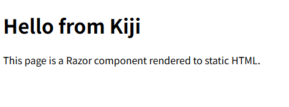
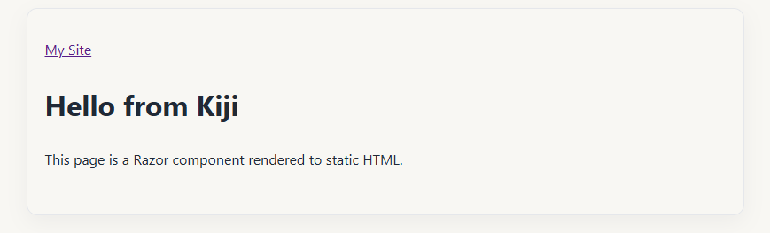
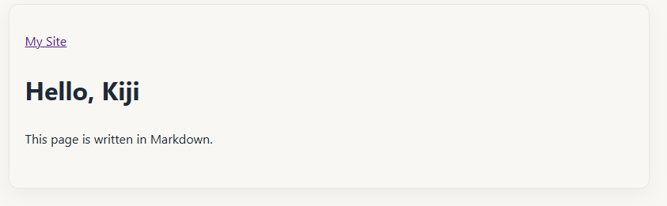

This guide starts with an empty .NET project and ends with a static site that has a Razor
home page, a Markdown-backed page, and a stylesheet. Kiji is a library rather than a
separate CLI, so you will use the usual `dotnet` commands throughout.

Each file example shows its complete contents at that step. Highlighted lines mark
additions or changes to an existing file.

## Create the project

Kiji requires the .NET 10 SDK. Create a console project and add the package:

```pwsh
dotnet new console -f net10.0 -o MySite
cd MySite
dotnet add package Kiji
```

Open `MySite.csproj` and change its first line to use the Razor SDK:

{data-line="1"}

```xml
<Project Sdk="Microsoft.NET.Sdk.Razor">

  <PropertyGroup>
    <OutputType>Exe</OutputType>
    <TargetFramework>net10.0</TargetFramework>
    <ImplicitUsings>enable</ImplicitUsings>
    <Nullable>enable</Nullable>
  </PropertyGroup>

  <ItemGroup>
    <PackageReference Include="Kiji" Version="0.1.0" />
  </ItemGroup>

</Project>
```

## Build the smallest site

Replace `Program.cs` with the site definition:

```csharp
using Kiji;

var app = StaticSite.Create(args);
app.Info = new SiteInfo
{
    BaseUrl = new Uri("https://example.com/"),
    Name = "My Site",
};

app.AddStaticPages();

return await app.RunAsync();
```

Create `Pages/Home.razor`:

```razor
@page "/"

<h1>Hello from Kiji</h1>
<p>This page is a Razor component rendered to static HTML.</p>
```

`AddStaticPages()` finds public components with fixed `@page` routes. Start the
development server:

```pwsh
dotnet watch
```

Open <http://localhost:8080>.



The server reloads the browser when you change a component
or content file.

## Add a layout and CSS

Files under `wwwroot/` are static assets. Kiji copies them to the same relative path in
the published site. Create `wwwroot/css/app.css`:

```css
body {
  max-width: 48rem;
  margin: 2rem auto;
  padding: 2rem 1.25rem;
  font-family: "Segoe UI", system-ui, sans-serif;
  line-height: 1.7;
  color: #1f2937;
  background: #f8f7f3;
  border: 1px solid #e5e7eb;
  border-radius: 0.75rem;
  box-shadow: 0 8px 24px rgba(15, 23, 42, 0.05);
}
```

Create `Components/PageHead.razor` to keep the page title, metadata, and stylesheet
link together:

```razor
@using Kiji
@using Kiji.Components
@inject SiteInfo Site
@inject NavigationManager NavigationManager

<StaticHeadContent>
    <meta charset="utf-8" />
    <meta name="viewport" content="width=device-width, initial-scale=1.0" />
    <title>@Title - @Site.Name</title>
    <link rel="canonical" href="@NavigationManager.Uri" />
    <link rel="stylesheet" href="@($"{Site.BaseUrl.AbsolutePath}css/app.css")" />
</StaticHeadContent>

@code {
    [Parameter] public string Title { get; set; } = string.Empty;
}
```

Create `Components/Layout.razor` for the shared page structure:

```razor
@using Kiji
@inherits LayoutComponentBase
@inject SiteInfo Site

<header>
    <a href="@Site.BaseUrl.AbsolutePath">@Site.Name</a>
</header>

<main>
    @Body
</main>
```

Update `Program.cs` to import the component namespace and register the layout:

{data-line="2,11"}

```csharp
using Kiji;
using MySite.Components;

var app = StaticSite.Create(args);
app.Info = new SiteInfo
{
    BaseUrl = new Uri("https://example.com/"),
    Name = "My Site",
};

app.UseDefaultLayout<Layout>();
app.AddStaticPages();

return await app.RunAsync();
```

Add `PageHead` to `Pages/Home.razor`:

{data-line="2,4"}

```razor
@page "/"
@using MySite.Components

<PageHead Title="Home" />

<h1>Hello from Kiji</h1>
<p>This page is a Razor component rendered to static HTML.</p>
```

Use `PageHead` once in each page so its title and shared head tags are supplied together.

Stop and restart `dotnet watch`.



The `BaseUrl` path is included in the stylesheet URL so the same markup works at a domain root and under a deployment sub-path such as GitHub Pages.

## Add a Markdown page

Create `Models/FrontMatter.cs` to define the YAML fields your posts use:

```csharp
namespace MySite.Models;

public sealed class FrontMatter
{
    public string? Title { get; set; }
    public string? Description { get; set; }
}
```

Create `contents/hello-kiji/index.md`:

```markdown
---
title: Hello, Kiji
description: The first post on my site.
---

This page is written in Markdown.
```

Create `Pages/Post.razor`. `Slug` supplies the route value, while `ContentKey` tells the component which Markdown item to render:

```razor
@page "/posts/{Slug}/"
@using Kiji
@using Kiji.Markdown
@using MySite.Components
@using MySite.Models
@inject ContentDictionary<MarkdownContent<FrontMatter>> Posts

@if (_post is not null)
{
    <PageHead Title="@(_post.FrontMatter.Title ?? "Untitled")" />

    <article>
        <h1>@_post.FrontMatter.Title</h1>
        <div>@((MarkupString)_html)</div>
    </article>
}

@code {
    [Parameter] public string Slug { get; set; } = string.Empty;
    [Parameter] public string ContentKey { get; set; } = string.Empty;

    private MarkdownContent<FrontMatter>? _post;
    private string _html = string.Empty;

    protected override async Task OnParametersSetAsync()
    {
        _post = Posts[ContentKey];
        _html = await _post.RenderAsync();
    }
}
```

Add the required namespaces and registrations to `Program.cs`:

{data-line="2-3,5-6,15,18-24"}

```csharp
using Kiji;
using Kiji.Markdown;
using Microsoft.Extensions.DependencyInjection;
using MySite.Components;
using MySite.Models;
using MySite.Pages;

var app = StaticSite.Create(args);
app.Info = new SiteInfo
{
    BaseUrl = new Uri("https://example.com/"),
    Name = "My Site",
};

app.UseMarkdownContent<FrontMatter>();
app.UseDefaultLayout<Layout>();
app.AddStaticPages();
app.AddPages<Post>(services => services
    .GetRequiredService<ContentDictionary<MarkdownContent<FrontMatter>>>()
    .Select(post => new
    {
        Slug = post.Value.FileInfo.Directory!.Name,
        ContentKey = post.Key,
    }));

return await app.RunAsync();
```

Update `Pages/Home.razor` so the post is reachable from the home page:

{data-line="2,4,10"}

```razor
@page "/"
@using Kiji
@using MySite.Components
@inject SiteInfo Site

<PageHead Title="Home" />

<h1>Hello from Kiji</h1>
<p>This page is a Razor component rendered to static HTML.</p>
<p><a href="@($"{Site.BaseUrl.AbsolutePath}posts/hello-kiji/")">Read the first post</a></p>
```

The directory name becomes the slug, so the new page is available at
<http://localhost:8080/posts/hello-kiji/>.



Kiji loads Markdown into a typed collection; your route mapping decides which URLs to generate.

## Publish the site

Stop the development server and publish:

```pwsh
dotnet publish
```

`dist/` now contains the generated HTML and `css/app.css`. It contains no .NET runtime or server application, so you can upload it to any static host.

Subsequent publishes can reuse unchanged pages automatically. Keep `.kiji/cache` to
preserve that work between builds.
See [Incremental builds](../incremental-builds/) for dependencies and CI caching.

The project now has this shape:

```text
MySite/
├── Components/       shared layouts and components
├── Pages/            routed Razor components
├── Models/           data models
├── contents/         Markdown and page-bundle images
├── wwwroot/          static assets copied as-is
├── Program.cs        the site definition
├── .kiji/            build cache and development output
└── dist/             published output
```

Add `dist/` and `.kiji/` to `.gitignore`. Continue with [Concepts](../concepts/) for the overall model, [Routing](../routing/) for more URL patterns, or [Deployment](../deployment/) when you are ready to host the site.
